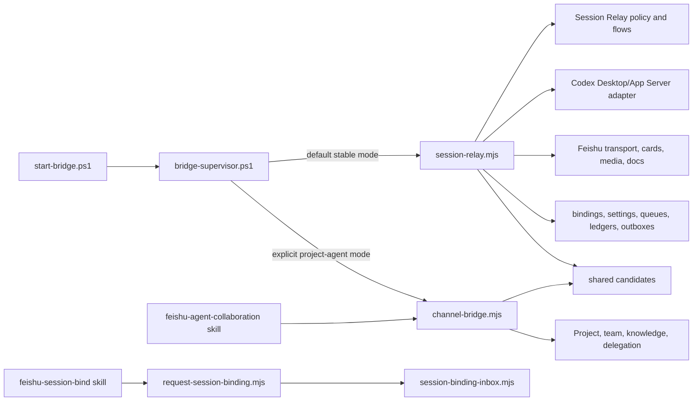

# Repository cleanup inventory

This document is the Phase 1 inventory for the repository state at `bd86ef6`.
It records ownership and references; it does not authorize deletion, relocation,
or behavior changes.

## Scope and method

The inventory covers all 158 tracked files:

| Surface | Count | Phase 1 treatment |
| --- | ---: | --- |
| Root production `.mjs` modules | 54 | Classified individually below |
| Root Node test files | 56 | Mapped to the owning production or operational family |
| Root PowerShell entry points and scripts | 17 | Classified individually below |
| Root and `docs/` documentation files | 15 | Retained as product, operations, architecture, or release history |
| JSON files | 3 | Retained as package locks/configuration compatibility surfaces |
| `.github/` governance files | 3 | Retained as repository governance |
| Stable Session binding skill files | 3 | Retained with the stable product |
| Experimental collaboration skill files | 3 | Retained with experimental collaboration |
| Repository metadata dotfiles | 3 | Retained for ignore, attributes, and editor consistency |
| Repository validation script | 1 | Retained as the `npm run check` contract |

References were checked through static local imports, PowerShell entry-point
references, package/configuration references, documentation, tests, and Git
history. Runtime files, generated configuration, DPAPI data, queues, ledgers,
bindings, and outboxes are intentionally outside the tracked-file count but are
listed as compatibility surfaces where relevant.

The classifications mean:

- **stable**: required by the supported personal Session Relay;
- **experimental**: required by Project Agent or collaboration mode;
- **shared candidate**: used across the stable/experimental boundary and needing
  a single documented owner before relocation;
- **removal candidate**: apparently orphaned or superseded, with deletion deferred
  until its compatibility evidence is resolved.

## Production module ledger

The following lists account for all 54 root production modules exactly once.

### Stable Session Relay — 26 modules

| Target area | Current files |
| --- | --- |
| `src/app/` | `session-relay.mjs`, `request-session-binding.mjs` |
| `src/codex/` | `codex-answer-media.mjs`, `codex-desktop-catalog.mjs`, `codex-session-controller.mjs`, `codex-session-observer.mjs`, `codex-session-store.mjs` |
| `src/feishu/` | `feishu-feed-group.mjs`, `feishu-inbound-attachment.mjs`, `feishu-long-answer-document.mjs`, `feishu-native-attachment.mjs`, `feishu-session-chat.mjs`, `session-stream-card.mjs` |
| `src/relay/` | `session-add-flow.mjs`, `session-binding-provisioner.mjs`, `session-binding-remover.mjs`, `session-delete-flow.mjs`, `session-relay-commands.mjs`, `session-relay-config.mjs`, `session-relay-core.mjs` |
| `src/persistence/` | `session-attachment-drafts.mjs`, `session-binding-inbox.mjs`, `session-binding-registry.mjs`, `session-input-ledger.mjs`, `session-prompt-queue.mjs`, `session-relay-settings.mjs` |

`session-stream-card.mjs` is Feishu presentation code even though its current name
begins with `session-`. Binding provision/remove/delete modules remain Relay
workflows because they coordinate several stores and external operations rather
than owning one durable format.

### Experimental collaboration — 24 modules

| Target area | Current files |
| --- | --- |
| `src/experimental/collaboration/app/` | `channel-bridge.mjs` |
| `src/experimental/collaboration/protocol/` | `agent-protocol.mjs`, `collaboration-request-inbox.mjs`, `team-router.mjs` |
| `src/experimental/collaboration/git/` | `collaboration-git.mjs`, `collaboration-landing.mjs`, `project-context.mjs` |
| `src/experimental/collaboration/commands/` | `knowledge-commands.mjs`, `operational-commands.mjs`, `project-commands.mjs`, `team-commands.mjs`, `team-task-commands.mjs` |
| `src/experimental/collaboration/persistence/` | `agent-event-outbox.mjs`, `audit-log.mjs`, `knowledge-hub.mjs`, `task-lease-store.mjs`, `team-task-store.mjs` |
| `src/experimental/collaboration/codex/` | `codex-status.mjs`, `desktop-project-state.mjs`, `executor-registry.mjs`, `rollout-completion.mjs` |
| `src/experimental/collaboration/feishu/` | `stream-progress.mjs` |
| `src/experimental/collaboration/runtime/` | `process-runner.mjs` |
| `src/experimental/collaboration/config/` | `team-config.mjs` |

These modules remain required by the optional `project-agent` mode. Their
classification as experimental is not a removal decision.

### Shared candidates — 3 modules

| File | Current consumers | Proposed owner | Decision required before Phase 2 |
| --- | --- | --- | --- |
| `codex-app-server.mjs` | Stable `session-relay.mjs`; experimental `channel-bridge.mjs` | `src/codex/` | Keep one Codex adapter; experimental code may import it through an explicit path |
| `delivery-outbox.mjs` | Both Bridge entry points | `src/persistence/` | Preserve its JSON schema and idempotency semantics; do not fork the store |
| `thread-work-queue.mjs` | Both Bridge entry points | `src/runtime/` | Keep process-local serialization neutral and free of Relay/collaboration policy |

### Resolved removal candidates

| Candidate | Import/script/doc references | Persisted or compatibility dependencies | Test coverage | Required proof before deletion |
| --- | --- | --- | --- | --- |
| `codex-session-runner.mjs` | Removed in Phase 5 after confirming no production, PowerShell, package, configuration, Skill, or documentation consumer. | It had no durable store and duplicated obsolete App Server spawn/WebSocket behavior. | Current controller, collector, observer, and shared connection tests cover persistent resume, queue/steer races, reconnect recovery, final-answer selection, RPC failures, notification routing, and pending-request cleanup. | Resolved: the stable Session Relay uses the persistent controller and shared App Server connection; the corrupted legacy runner is no longer a root-level production candidate. |

## PowerShell and operational ledger

Root PowerShell names are installed/update compatibility surfaces. Phase 2 may
move implementations only when the current root names remain as backward-compatible
wrappers.

| Classification | Current files | Evidence and constraints |
| --- | --- | --- |
| Stable startup/process control | `bridge-supervisor.ps1`, `start-app-server.ps1`, `start-at-login.ps1`, `start-bridge.ps1`, `status-bridge.ps1`, `stop-bridge.ps1` | Called by install/update scripts, scheduled startup, or each other; root names are public operations entry points |
| Stable Desktop relay lifecycle | `configure-codex-desktop-relay.ps1`, `desktop-relay-bootstrap.ps1`, `desktop-relay-pointer.ps1`, `launch-codex-desktop-with-relay.ps1` | Pointer ownership, explicit direct/proxy selection and fail-open behavior are compatibility surfaces verified by Windows operational integration tests and doctor checks |
| Stable install/update/auth | `configure-feishu-app.ps1`, `doctor.ps1`, `install.ps1`, `setup-channel-secret.ps1`, `update.ps1`, `verify-feishu-app.ps1` | Public installation contract; must preserve DPAPI, config, runtime state, safe Feishu template/verification output, rollback, and command-line parameters |
| Stable adapters and validation | `lark-cli.ps1`, `install-smoke.ps1`, `update-smoke.ps1` | `lark-cli.ps1` is selected dynamically through configuration/docs; smoke scripts are direct validation entry points, and update smoke is invoked by `update-script.test.mjs` |
| Resolved removal candidate | None | `restart-after-current-turn.ps1` was removed after confirming that released tags, current install/update scripts, Windows scheduled tasks, and Windows services never invoked it. Session binding reloads use the Supervisor-owned `restart.request` handshake instead. |

Post-inventory Windows onboarding additions keep the root PowerShell compatibility
surface and add one narrow platform adapter,
`src/runtime/platform/windows/feishu-app-entry.mjs`. Shared proxy-environment
filtering and the private browser redirect live in `src/runtime/shared/`; they
contain no product policy or persisted schema.

## Tests, skills, configuration, and documentation

### Test ownership

- Module tests named `*.test.mjs` move with their owning stable, experimental,
  shared-candidate, or removal-candidate module.
- `agent-collaboration-flow.test.mjs` is an experimental integration test spanning
  the Agent protocol, outbox, Git handoff, and task state.
- `collaboration-skill.test.mjs` protects the experimental `.agents` skill contract.
- `channel-wire-format.test.mjs` protects Feishu Channel SDK decoding used at the
  application boundary.
- `desktop-relay-startup.test.mjs` and `update-script.test.mjs` are Windows
  operational integration tests.
- `session-relay.mjs` is protected indirectly by command, controller, observer,
  attachment, card, persistence, and configuration tests; Phase 4 needs explicit
  characterization tests before extracting orchestration from the entry point.
- `request-session-binding.mjs` is exercised through
  `session-binding-inbox.test.mjs` and the stable skill workflow, but has no direct
  CLI test. Add a CLI characterization test before relocating its implementation.

### Skill ownership

| Current path | Classification | Target |
| --- | --- | --- |
| `skills/feishu-session-bind/` | Stable | Keep as the installed Session binding skill; update its internal script path only through an install-compatible migration |
| `.agents/skills/feishu-agent-collaboration/` | Experimental | Move or package with experimental collaboration in Phase 3; preserve its documented Git and privacy safety contract |

### Configuration and repository support

- `bridge.config.example.json`, `package.json`, and `package-lock.json` are retained.
  The example schema and locked dependency graph are compatibility/build surfaces.
- `.github/CODEOWNERS`, `.github/PULL_REQUEST_TEMPLATE.md`, and
  `.github/workflows/ci.yml` are the Phase 0 governance baseline.
- `scripts/check-repository.mjs` remains the repository validation entry used by
  `npm run check`.
- `README.md`, `CONTRIBUTING.md`, `AGENTS.md`, active product/installation docs,
  architecture docs, and versioned release notes are retained. Historical release
  notes are archives, not duplicate current instructions.

## Dependency graph

### Process and product boundaries

The stable startup choice is already explicit in PowerShell, but both JavaScript
entry points and all their dependencies still occupy the repository root. Phase 2
moves stable/shared code mechanically; Phase 3 moves the experimental graph and
removes any accidental stable startup dependency on it.

### Direct local imports for all production modules

`—` means the file has no local production-module import. Node built-ins and npm
packages are omitted.

| Module | Classification | Direct local imports |
| --- | --- | --- |
| `agent-event-outbox.mjs` | Experimental | — |
| `agent-protocol.mjs` | Experimental | `collaboration-request-inbox.mjs` |
| `audit-log.mjs` | Experimental | — |
| `channel-bridge.mjs` | Experimental entry | `agent-event-outbox.mjs`, `agent-protocol.mjs`, `audit-log.mjs`, `codex-app-server.mjs`, `codex-status.mjs`, `collaboration-git.mjs`, `collaboration-landing.mjs`, `collaboration-request-inbox.mjs`, `delivery-outbox.mjs`, `desktop-project-state.mjs`, `executor-registry.mjs`, `knowledge-commands.mjs`, `knowledge-hub.mjs`, `operational-commands.mjs`, `process-runner.mjs`, `project-commands.mjs`, `project-context.mjs`, `rollout-completion.mjs`, `stream-progress.mjs`, `task-lease-store.mjs`, `team-commands.mjs`, `team-config.mjs`, `team-router.mjs`, `team-task-commands.mjs`, `team-task-store.mjs`, `thread-work-queue.mjs` |
| `codex-answer-media.mjs` | Stable | — |
| `codex-app-server.mjs` | Shared candidate | — |
| `codex-desktop-catalog.mjs` | Stable | `codex-session-store.mjs` |
| `codex-session-controller.mjs` | Stable | `codex-session-observer.mjs`, `feishu-inbound-attachment.mjs` |
| `codex-session-observer.mjs` | Stable | `feishu-inbound-attachment.mjs` |
| `codex-session-store.mjs` | Stable | — |
| `codex-status.mjs` | Experimental | — |
| `collaboration-git.mjs` | Experimental | `collaboration-request-inbox.mjs`, `project-context.mjs` |
| `collaboration-landing.mjs` | Experimental | — |
| `collaboration-request-inbox.mjs` | Experimental | — |
| `delivery-outbox.mjs` | Shared candidate | — |
| `desktop-project-state.mjs` | Experimental | — |
| `executor-registry.mjs` | Experimental | — |
| `feishu-feed-group.mjs` | Stable | — |
| `feishu-inbound-attachment.mjs` | Stable | — |
| `feishu-long-answer-document.mjs` | Stable | — |
| `feishu-native-attachment.mjs` | Stable | — |
| `feishu-session-chat.mjs` | Stable | `feishu-feed-group.mjs` |
| `knowledge-commands.mjs` | Experimental | — |
| `knowledge-hub.mjs` | Experimental | — |
| `operational-commands.mjs` | Experimental | — |
| `process-runner.mjs` | Experimental | — |
| `project-commands.mjs` | Experimental | — |
| `project-context.mjs` | Experimental | — |
| `request-session-binding.mjs` | Stable entry | `session-binding-inbox.mjs`, `session-relay-config.mjs` |
| `rollout-completion.mjs` | Experimental | — |
| `session-add-flow.mjs` | Stable | — |
| `session-attachment-drafts.mjs` | Stable | `feishu-inbound-attachment.mjs` |
| `session-binding-inbox.mjs` | Stable | — |
| `session-binding-provisioner.mjs` | Stable | `codex-desktop-catalog.mjs` |
| `session-binding-registry.mjs` | Stable | `session-relay-config.mjs` |
| `session-binding-remover.mjs` | Stable | — |
| `session-delete-flow.mjs` | Stable | — |
| `session-input-ledger.mjs` | Stable | — |
| `session-prompt-queue.mjs` | Stable | `feishu-inbound-attachment.mjs` |
| `session-relay.mjs` | Stable entry | `codex-answer-media.mjs`, `codex-app-server.mjs`, `codex-desktop-catalog.mjs`, `codex-session-controller.mjs`, `codex-session-observer.mjs`, `codex-session-store.mjs`, `delivery-outbox.mjs`, `feishu-feed-group.mjs`, `feishu-inbound-attachment.mjs`, `feishu-long-answer-document.mjs`, `feishu-native-attachment.mjs`, `feishu-session-chat.mjs`, `session-add-flow.mjs`, `session-attachment-drafts.mjs`, `session-binding-inbox.mjs`, `session-binding-provisioner.mjs`, `session-binding-registry.mjs`, `session-binding-remover.mjs`, `session-delete-flow.mjs`, `session-input-ledger.mjs`, `session-prompt-queue.mjs`, `session-relay-commands.mjs`, `session-relay-config.mjs`, `session-relay-core.mjs`, `session-relay-settings.mjs`, `session-stream-card.mjs`, `thread-work-queue.mjs` |
| `session-relay-commands.mjs` | Stable | — |
| `session-relay-config.mjs` | Stable | `feishu-inbound-attachment.mjs` |
| `session-relay-core.mjs` | Stable | — |
| `session-relay-settings.mjs` | Stable | — |
| `session-stream-card.mjs` | Stable | `feishu-native-attachment.mjs` |
| `stream-progress.mjs` | Experimental | — |
| `task-lease-store.mjs` | Experimental | — |
| `team-commands.mjs` | Experimental | `collaboration-request-inbox.mjs` |
| `team-config.mjs` | Experimental | `collaboration-request-inbox.mjs` |
| `team-router.mjs` | Experimental | — |
| `team-task-commands.mjs` | Experimental | — |
| `team-task-store.mjs` | Experimental | — |
| `thread-work-queue.mjs` | Shared candidate | — |

### Boundary debt to preserve, then resolve semantically

| Current edge | Why it is debt | Earliest phase allowed to change behavior |
| --- | --- | --- |
| `codex-session-controller.mjs` → `feishu-inbound-attachment.mjs` | Codex owns the Desktop input wrapper while Feishu currently owns attachment normalization/building | Phase 5, after characterization; Phase 2 only rewrites the moved path |
| `codex-session-observer.mjs` → `feishu-inbound-attachment.mjs` | Codex observer strips a Feishu-owned wrapper from Desktop events | Phase 5, after the wrapper contract has a narrow Codex-facing interface |
| `session-relay-config.mjs` → `feishu-inbound-attachment.mjs` | Relay config imports Feishu default limits | Phase 4 or 5; Phase 2 keeps the edge unchanged |
| `channel-bridge.mjs` → stable shared candidates | Experimental startup consumes stable adapters/stores directly | Phase 3 creates explicit experimental imports without making stable startup load collaboration |

## Phase 2 move manifest and gates

Phase 2 is mechanical. It should:

1. Move the 26 stable modules and 3 shared candidates to the target directories
   above, with only import/path and test-location changes.
2. Move their tests under `tests/unit/` or `tests/integration/` without changing
   assertions.
3. Keep root operational PowerShell entry points. When JavaScript entry-point
   locations change, retain root compatibility launchers required by install,
   update, status, and supervisor scripts.
4. Leave all 24 experimental modules and the experimental skill for Phase 3 so
   the mechanical stable migration does not claim experimental isolation.
5. Leave both removal candidates untouched. Deletion requires a separate,
   evidence-backed change after the relevant compatibility tests have moved.

Phase 2 must not alter persisted JSON, configuration defaults, commands, Feishu
messages/cards, App Server payloads, DPAPI state, process lifecycle, or tests'
behavioral assertions. Its required validation is `npm run check`; because the
PowerShell entry paths are part of the move contract, also run the install smoke,
updater smoke, status, and doctor checks before local redeployment.
